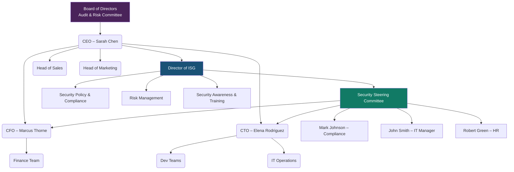

# GRC102 – Information Security Governance
## Lab 5 Submission – GlobalHealth Connect

**Student:** Victoria Onyekachi Mbachu

**Course:** GRC102 – Information Security Governance

**Week:** 5

**Date:** March 6, 2026

---

# TASK 1: The Governance Blueprint

## Proposed Security Governance Structure

The current GHC structure has no dedicated security function. John Smith handles some security tasks as part of his IT role, but that is not enough for a company that manages patient health records. Security needs its own place in the organisation with clear authority.

The proposed structure places the Director of Information Security Governance (ISG) directly under the CEO. This gives security the authority to work across all departments. A Security Steering Committee (SSC) is also created to bring Finance, Technology, Legal, and HR into security decisions.

**Key decisions:**

- The Director of ISG reports to the CEO so security has the authority to act across all departments without interference.
- The Board Audit Committee receives direct security updates, which addresses David Miller's request for clear accountability.
- The SSC includes the CFO, CTO, Compliance, IT, and HR so all departments share responsibility for security decisions.
- Three sub-teams handle Policy, Risk, and Training so the workload is shared as GHC grows.

---

## RACI Matrix

R = Responsible (does the work) | A = Accountable (owns the result) | C = Consulted (gives input) | I = Informed (told of outcome)

| Activity | Director ISG | CEO (Sarah) | CFO (Marcus) | CTO (Elena) | IT (John) | Compliance (Mark) | Board |
|---|---|---|---|---|---|---|---|
| Approving security policies | R | A | C | C | C | C | I |
| Running risk assessments | R/A | I | C | C | C | C | I |
| Incident response planning | A | I | C | C | R | C | I |
| Security awareness training | A | I | I | C | C | R | I |
| HIPAA/GDPR compliance monitoring | C | I | C | C | C | R/A | I |
| Approving the security budget | C | A | R | C | I | I | I |
| Reporting to the Board | R/A | C | I | I | I | C | I |
| New project security review | R/A | I | I | A | C | C | I |

---

# TASK 2: The Security Charter

## GHC Information Security Charter

---

# GlobalHealth Connect – Information Security Charter

**Reference:** GHC-ISG-CHR-001

**Version:** 1.0

**Date:** March 6, 2026

---

## 1. Purpose

GHC manages health records for over 500 clinics. That data belongs to real patients and must be protected. A breach would damage client trust, expose GHC to heavy regulatory fines, and hurt the company's reputation.

This charter formally creates GHC's Information Security Programme. It sets out what the programme covers, who is responsible, and what authority it has to enforce security across the company.

---

## 2. Scope

This charter applies to:

- All patient data (PHI), employee records, financial data, and company intellectual property
- All GHC staff, contractors, and third-party vendors with system access
- All GHC systems including cloud platforms, development environments, and business software
- All US operations under HIPAA and any processing of EU citizen data under GDPR
- All acquired companies, which must align to this charter within 6 months of acquisition

---

## 3. Authority

The Board of Directors grants the Information Security Programme authority to:

- Create and enforce security policies across all departments
- Conduct security audits, risk assessments, and penetration tests on any GHC system
- Require teams to fix identified security issues within agreed timeframes
- Review all new technologies, vendor contracts, and acquisitions before they go live

The Director of ISG holds this authority and reports to the CEO, with direct reporting to the Board Audit Committee.

---

## 4. Roles and Responsibilities

| Role | Responsibility |
|---|---|
| Board / Audit Committee | Oversight and approval of the charter; receives quarterly security reports |
| CEO – Sarah Chen | Approves the charter and annual security plan |
| Director of ISG | Runs the programme; chairs the SSC; reports to the Board |
| CFO – Marcus Thorne | Approves the security budget; manages financial risk |
| CTO – Elena Rodriguez | Ensures security is built into all development work |
| Compliance – Mark Johnson | Monitors HIPAA, GDPR, and HITECH requirements |
| IT Manager – John Smith | Implements technical controls and manages patching |
| All Staff | Follow policies, complete training, and report security concerns |

---

## 5. Key Principles

1. Focus security effort on the highest risks first.
2. Security should support business goals, not block them.
3. Regulatory compliance is the minimum standard, not the target.
4. Security must be built into new products from the beginning.
5. The programme is reviewed and improved on a regular schedule.
6. Every employee shares responsibility for security.

---

## 6. Reporting

- The Director of ISG provides a monthly update to the CEO.
- A quarterly security report goes to the Board Audit Committee.
- Any serious incident involving patient data is reported to the CEO within 24 hours and the Board within 72 hours.
- A full annual programme review is presented to the Board each year.

---

## 7. Review and Approval

This charter is reviewed every year or after any major change such as an acquisition, new regulation, or serious breach. Changes require CEO approval and Board ratification.

---

**Effective Date:** March 6, 2026

**Approved By:** Sarah Chen, CEO

**Reviewed By:** Marcus Thorne, CFO | David Miller, Board Member

---

## Memo to Marcus Thorne (CFO)

**To:** Marcus Thorne, CFO

**From:** Victoria Onyekachi Mbachu, Director of ISG

**Date:** March 6, 2026

**Re:** Security Charter: Alignment with GHC Strategy

The Information Security Charter provides the clear mandate and accountability structure that GHC currently lacks. Every security decision and expenditure will sit within a documented programme with defined authority and reporting obligations. This gives the Finance team visibility into what is being spent on security and why.

The business case is clear. HIPAA violations can result in fines of tens of millions of dollars, plus breach notification costs and client loss. The charter directly supports GHC's Goal 3 (customer trust) and Goal 5 (regulatory excellence), both of which protect company revenue. A structured security programme is a financial risk management tool, not just a technical one.

---

# TASK 3: Board Reporting and Metrics

## Board Security Report

---

# Information Security Report – Board of Directors

**Period:** September 2025 – February 2026

**Prepared by:** Victoria Onyekachi Mbachu, Director of ISG

**Date:** March 6, 2026

---

## 1. Overall Security Posture: RED

GHC's current security posture is rated RED. Over the past six months, security threats have increased while the ability to address them has declined. Incidents are rising every month. The new governance programme is designed to reverse these trends, but the Board must understand the current position first.

---

## 2. Key Security Metrics

| Metric | Feb 2026 | 6-Month Trend | Commentary |
|---|---|---|---|
| High-Risk Incidents | 7 per month | Worsening | Up from 2 in September, a 250% increase. Each incident is a potential patient data exposure and a possible HIPAA notification event. |
| Critical Patching Compliance | 55% | Declining | Only 55% of critical vulnerabilities are being fixed. The backlog has grown from 15 to 40 per month. Unpatched systems are the most common entry point for attackers. |
| Phishing Attempts | 320 per month | Worsening | More than doubled from 150 in September. Higher volume increases the chance of a successful attack, especially with incomplete staff training. |
| Security Training Completion | 70% | Improving | The only positive trend. Up from 45%, but 30% of staff handling patient data remain untrained. |
| Malware Detections | 50 per month | Worsening | Doubled from 25. Directly linked to rising phishing volumes and low patching rates. |

---

## 3. Key Risks

- **Vulnerability backlog:** The number of unpatched critical vulnerabilities is growing faster than the team can fix them. These are known weaknesses that attackers can exploit.
- **Untrained staff:** 30% of GHC employees have not completed security training. Phishing is the most common attack method, and untrained staff are the most likely to fall for it.

---

## 4. Recommendations

- **30-day patching sprint:** Assign dedicated IT resource to clear the critical vulnerability backlog and reach 90% patching compliance by April 30, 2026.
- **Mandatory training deadline:** Set April 30, 2026 as the deadline for 100% training completion, backed by Board authority. Begin monthly phishing simulations to measure whether training is working.

---

## Deliverable 3.2 – Rationale for Metric Selection

The five metrics were chosen because they show the full picture from threat to impact. Phishing and malware show the level of external threat. Patching compliance and training completion show how well GHC can defend against that threat. High-risk incidents show what happens when threats are high and defences are low. Together they give the Board a clear, business-level view of security health without requiring technical knowledge. Raw technical data such as firewall logs or SIEM alerts were excluded because they do not communicate risk in a way that supports Board-level decisions.

---

# TASK 4: The Security Steering Committee

## SSC Terms of Reference

---

# GlobalHealth Connect – Security Steering Committee Terms of Reference

**Reference:** GHC-ISG-SSC-TOR-001
**Version:** 1.0
**Date:** March 6, 2026

---

## 1. Purpose

The SSC provides a forum where senior leaders from across GHC make security decisions together. It ensures that security policy is aligned with business needs, that conflicts between departments are resolved fairly, and that security investment is approved with full business context.

---

## 2. Scope

The SSC oversees:

- Approval and review of security policies
- Review and prioritisation of the risk register
- Resolution of conflicts between security and business operations
- Approval of security budget requests
- Oversight of major incident responses
- Security review of new products, vendors, and acquisitions

---

## 3. Membership

| Role | Member | Status |
|---|---|---|
| Chair | Director of ISG | Permanent |
| Co-Sponsor | CEO – Sarah Chen | Permanent |
| Finance | CFO – Marcus Thorne | Permanent |
| Technology | CTO – Elena Rodriguez | Permanent |
| IT Operations | IT Manager – John Smith | Permanent |
| Compliance | Mark Johnson | Permanent |
| HR | Robert Green | Permanent |
| Subject Matter Expert | Invited as needed | Ad hoc |

Permanent members who miss two consecutive meetings without sending a delegate will be escalated to the CEO.

---

## 4. Member Responsibilities

- Review agenda materials sent five business days before each meeting.
- Represent their department's perspective honestly.
- Support and communicate SSC decisions within their own teams.
- Complete assigned action items by agreed deadlines.

---

## 5. Meeting Cadence

- Monthly scheduled meetings with dates set at the start of each year.
- Emergency meetings can be called by the Chair with 48 hours notice.
- Quorum requires four permanent members including the Chair and at least one of CEO, CFO, or CTO.
- Minutes are distributed within five business days of each meeting.

---

## 6. Decision-Making

- The SSC approves, amends, or retires security policies within the scope of the charter.
- Risks below the defined threshold can be formally accepted by the SSC. Higher risks go to the CEO or Board.
- Spending within the approved annual budget can be approved by the SSC. Requests above the defined limit go to the CFO and CEO.
- For conflicts, both sides present their case, the SSC discusses, and a majority vote decides. The Chair holds the casting vote in a tie.
- Unresolved matters are escalated to the CEO with a recommendation from the Chair.

---

## 7. Reporting

- The Chair sends the CEO a monthly summary of decisions and open actions.
- A quarterly SSC summary is included in the Board security report.
- All major decisions are formally minuted and retained for audit purposes.

---

## SSC Meeting Agenda

---

# GHC Security Steering Committee – Inaugural Meeting Agenda

**Date:** March 20, 2026

**Time:** 10:00 AM – 12:00 PM

**Location:** GHC Boardroom / MS Teams

**Chair:** Victoria Onyekachi Mbachu, Director of ISG

**Attendees:** Sarah Chen, Marcus Thorne, Elena Rodriguez, John Smith, Mark Johnson, Robert Green

---

**1. Welcome and Introductions (10 min)**
Overview of the SSC mandate. Formal adoption of the Terms of Reference.

**2. Security Posture Update (15 min)**
Summary of the Board Security Report. Current RED status, key trends, and immediate priorities.

**3. Password Policy Dispute (40 min)**

This is the main discussion item for this meeting.

- John Smith presents the proposed policy and the security rationale behind it. (10 min)
- Elena Rodriguez presents the developer impact and her alternative proposal using MFA and a password manager. (10 min)
- Open discussion from all members. The Chair will share NIST SP 800-63B guidance, which supports long passphrases and MFA over frequent password changes. (15 min)
- Vote and decision. (5 min)

Proposed resolution for discussion: 14-character minimum passphrase, no mandatory 30-day rotation, mandatory enterprise password manager, and MFA required on all systems handling PHI within 60 days.

**4. Initial Risk Register Review (15 min)**
Top five organisational risks presented for awareness. Risk owners assigned.

**5. Training Completion Deadline (10 min)**
Proposal: 100% mandatory completion by April 30, 2026. Robert Green and Elena Rodriguez to confirm feasibility.

**6. Any Other Business (5 min)**

**7. Action Items and Close (5 min)**
All actions confirmed with owners and deadlines. Next meeting: April 17, 2026.

---

*Pre-reading required: Board Security Report | Draft Password Policy | SSC Terms of Reference*

---

## Deliverable 4.3 – Briefing Note to Sarah Chen

**To:** Sarah Chen, CEO

**From:** Victoria Onyekachi Mbachu, Director of ISG

**Date:** March 6, 2026

**Re:** How the SSC resolves cross-departmental security conflicts

The password policy dispute between Elena Rodriguez and John Smith is a good example of what happens when security decisions are made without a structured process. Both parties have valid points, but without a neutral forum, the disagreement escalates and lands on the CEO's desk.

The SSC solves this. Both sides present their case to a full committee that includes Finance, Legal, and HR. All perspectives are heard, a decision is reached by vote, and it is documented. The outcome carries the authority of the whole committee, not just one department. This keeps security conflicts out of the CEO's inbox and ensures that decisions reflect the needs of the whole business.

---

# TASK 5: Governance Maturity Assessment

## Maturity Assessment Table

| Governance Domain | Score (1–5) | Justification |
|---|---|---|
| Policy & Documentation | 2 | Policies exist but were inherited from acquired companies. They are inconsistent, outdated, and not actively maintained. Some documentation exists but it is not standardised or followed consistently. |
| Roles & Responsibilities | 1 | The HR Manager confirmed that security ownership is unclear. Nobody knows who is responsible for what. There are no defined roles, no RACI, and no accountability structure in place. |
| Risk Management | 2 | GHC responds to incidents after they happen but has no formal proactive risk process. No risk register exists. Some awareness is present but nothing is structured or documented. |
| Metrics & Reporting | 2 | Technical metrics are tracked but cannot be translated into business language for Board reporting. Data exists but meaningful reporting does not. |
| Training & Awareness | 2 | Annual training is mandatory, which places GHC above Level 1. However, completion was only 45% six months ago and engagement is low. The programme is treated as a checkbox rather than a genuine awareness effort. |
| Compliance | 2 | The Compliance Officer manages regulatory requirements, but the team scrambles during audits rather than monitoring continuously. Compliance is reactive, not sustained. |

**Overall maturity: approximately 1.8 out of 5.**

---

## Roadmap to Level 3 (12 to 18 Months)

---

**Initiative 1: Build a Complete Policy Library**

Objective: Replace all inherited and inconsistent policies with one approved set that every GHC employee can access and follow.

Key activities: Audit all existing policies from GHC and acquired companies. Write a core policy set covering Acceptable Use, Access Control, Data Classification, Incident Response, Password Management, and Vendor Security. Get approval through the SSC and CEO. Publish on the company intranet with review dates.

Expected outcome: All core policies approved and published within 6 months. Policy coverage moves from inconsistent to complete.

---

**Initiative 2: Implement a Formal Risk Management Process**

Objective: Move from reacting to incidents to identifying and managing risks before they become problems.

Key activities: Write a Risk Management Standard that defines how risks are scored and when to escalate. Conduct the first enterprise risk assessment within 90 days. Create a live risk register reviewed monthly at the SSC. Assign a named owner to every risk.

Expected outcome: First risk assessment completed and presented to the Board within 90 days. Risk management becomes a continuous process, not a one-time activity.

---

**Initiative 3: Clarify Security Roles and Ownership**

Objective: Ensure every person in a security-relevant role knows exactly what they are responsible for.

Key activities: Publish the RACI matrix as an official GHC document. Update job descriptions to include security responsibilities. Deliver a manager briefing. Add security responsibility to the annual performance review process.

Expected outcome: RACI approved and job descriptions updated within 90 days. Security ownership is clear and documented across the organisation.

---

**Initiative 4: Standardise Security Reporting**

Objective: Give the Board and SSC security reporting that helps them make decisions.

Key activities: Use the five-metric Board dashboard from Task 3 as the standard format. Automate data collection where possible. Set a monthly SSC dashboard and quarterly Board report as fixed deliverables. Define target values for each metric.

Expected outcome: First standardised Board report delivered within 30 days. Progress is tracked against defined targets, not just reported.

---

**Initiative 5: Improve Security Training**

Objective: Reach 100% training completion and change how staff respond to real security threats.

Key activities: Replace the annual session with quarterly short modules on relevant topics. Run monthly phishing simulations. Set April 30 as the mandatory completion deadline. Report results at every SSC meeting.

Expected outcome: 100% training completion by April 30, 2026. Phishing simulation click rates reduced by 50% within 12 months.

---

## Executive Summary for David Miller (Board Member)

**To:** David Miller, Board Member

**From:** Victoria Onyekachi Mbachu, Director of ISG

**Date:** March 6, 2026

**Re:** GHC Security Governance Maturity Assessment

GHC's security governance maturity currently sits at approximately Level 2 out of 5 across most areas, with Roles and Responsibilities at Level 1. In practical terms, this means security activity is happening but it is not organised, not consistently owned, and not producing reliable outcomes. Policies are outdated. Nobody is clear on who owns what. Risk management is reactive. Training is incomplete. This is the environment in which the recent near-miss occurred, and it cannot be the foundation for a company managing patient data at GHC's scale.

The proposed roadmap covers five initiatives over 12 to 18 months, each designed to bring a specific area to Level 3. Level 3 means documented processes, clear ownership, and consistent execution. Each initiative has a named owner, a deadline, and a measurable outcome so the Board can track real progress at every quarterly review.

