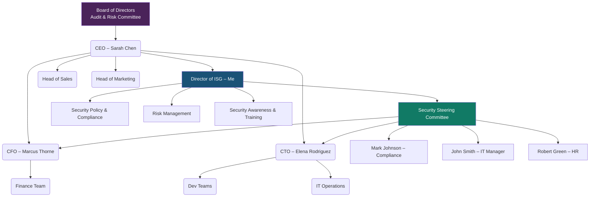

# GRC102 – Information Security Governance
## Lab 5 Submission
**Student:** Victoria Onyekachi Mbachu

**Course:** GRC102 – Information Security Governance

**Week:** 5

**Date:** March 6, 2026

---

# TASK 1: The Governance Blueprint

## Deliverable 1.1 – My Proposed Security Governance Structure

When I looked at the current GHC org chart, the first thing I noticed was that nobody actually owns security. John Smith in IT does some security-related work on top of his regular IT job, but that's not the same thing. Security being buried inside IT Operations is a problem. It means security decisions get filtered through an IT lens, and business leaders like Marcus or Elena never really engage with it directly.

What I decided to do is this. I want to pull security out of IT and put the Director of ISG (me) directly under Sarah Chen. This would ensure access. If I report to the CEO, I can actually get things done across departments. If I report to IT, I'm just another person in the IT chain.

I also want to create a Security Steering Committee (SSC) that includes people from Finance, Tech, Legal, and HR. 

---

## RACI Matrix

**Quick legend:** R = Responsible | A = Accountable | C = Consulted | I = Informed

| Activity | Me (Director ISG) | Sarah (CEO) | Marcus (CFO) | Elena (CTO) | John (IT) | Mark (Compliance) | Board |
|---|---|---|---|---|---|---|---|
| Approving security policies | R | A | C | C | C | C | I |
| Running a risk assessment | R/A | I | C | C | C | C | I |
| Incident response planning | A | I | C | C | R | C | I |
| Security awareness training | A | I | I | C | C | R | I |
| HIPAA/GDPR compliance monitoring | C | I | C | C | C | R/A | I |
| Approving the security budget | C | A | R | C | I | I | I |
| Reporting to the Board | R/A | C | I | I | I | C | I |
| Reviewing security on new projects | R/A | I | I | A | C | C | I |

---

# TASK 2: The Security Charter

## Deliverable 2.1 – GHC Information Security Charter

---

# GlobalHealth Connect – Information Security Charter

**Reference:** GHC-ISG-CHR-001
**Version:** 1.0
**Date:** March 6, 2026

---

## 1. Purpose

GHC handles health records for over 500 clinics. That's a lot of sensitive patient data sitting in our systems every single day. One serious breach doesn't just hurt us financially — it breaks the trust that our entire business is built on. Clinics chose us because they believe we'll keep patient data safe. We need a formal security programme to back that up, not just good intentions.

This charter sets up that programme. It defines what we're doing, who's responsible, and what authority I have to actually enforce things. It also replaces all the ad-hoc security habits we've picked up from the startups we've acquired — those need to go.

---

## 2. Scope

This covers everything:

- All patient data (PHI), employee records, financial data, and company IP
- Every GHC employee, contractor, and vendor with access to our systems
- All our systems — cloud, on-premise, developer environments, mobile devices, and the SaaS tools we use day-to-day
- Our US operations (HIPAA applies) and any processing of EU patient data (GDPR applies)
- Both acquired companies — they need to align to this charter within 6 months of acquisition

---

## 3. Authority

The Board of Directors gives the Information Security Programme formal authority to:

- Write, publish, and enforce security policies across every department
- Run or commission security audits, risk assessments, and penetration tests on any GHC system
- Require teams to fix security problems within agreed timeframes — and escalate to the CEO if they don't
- Review and approve or flag any new technology, vendor, or acquisition before it goes live

As Director of ISG, I hold this authority. I report to Sarah Chen (CEO) and have a direct line to the Board's Audit Committee.

---

## 4. Roles and Responsibilities

| Person/Group | What they're responsible for |
|---|---|
| Board / Audit Committee | Oversight, approving the charter, receiving quarterly security updates |
| Sarah Chen (CEO) | Approves the charter and annual security plan; sets the tone from the top |
| Me (Director ISG) | Run the whole programme; chair the SSC; report to the Board; own risk management |
| Marcus Thorne (CFO) | Approves the security budget; makes sure financial risk is understood |
| Elena Rodriguez (CTO) | Makes sure security is baked into development from the start |
| Mark Johnson (Compliance) | Tracks HIPAA, GDPR, and HITECH requirements; manages audits |
| John Smith (IT Manager) | Implements the technical controls; manages patching and vulnerability fixes |
| All GHC staff | Follow the policies, complete training, and report anything suspicious |

---

## 5. Key Principles

These are the things I want to guide how we do security at GHC:

1. **Risk first:** We focus effort where the actual risk is, not just where it's easiest.
2. **Security should help the business, not slow it down:** Elena's concern about developer productivity is valid. Security that creates workarounds defeats itself.
3. **Compliance is the minimum:** HIPAA and GDPR tell us the floor. We should aim higher.
4. **Build it in from the start:** Security added after the fact is always worse and more expensive than security built in from day one.
5. **Keep improving:** Threats change. What works today might not work next year. We review and update constantly.
6. **Everyone owns it:** Security isn't just my job. Every person at GHC plays a role.

---

## 6. Reporting

- I give Sarah a monthly security update
- I present a quarterly security report to the Board's Audit Committee — covering incidents, risks, compliance, and programme progress
- If there's a serious incident involving patient data, I tell Sarah within 24 hours and the Board within 72 hours
- Every year, I do a full programme review with the Board to set the next year's direction and budget

---

## 7. Review and Approval

I'll review this charter every year, or sooner if something big changes — like a major acquisition, a new regulation, or a serious breach. Any changes need CEO sign-off and Board ratification.

---

**Effective Date:** March 6, 2026
**Approved By:** Sarah Chen, CEO
**Reviewed By:** Marcus Thorne, CFO | David Miller, Board

---

## Deliverable 2.2 – Memo to Marcus Thorne (CFO)

**To:** Marcus Thorne, CFO
**From:** [Your Name], Director of Information Security Governance
**Date:** March 6, 2026
**Re:** Why the Security Charter makes financial sense

Marcus, I know your concern is accountability and making sure every dollar spent on security has a clear reason behind it. That's exactly what this charter gives you. Right now, security spending at GHC is ad-hoc — requests come in, money gets spent, but there's no formal structure tying it to business outcomes. The charter changes that. Every security investment now sits inside a defined programme with documented authority, scope, and reporting. You'll be able to see what we're spending, why, and what risk it's addressing.

The financial case is also straightforward. A HIPAA violation can run into the tens of millions in fines, on top of the cost of breach notification, legal fees, and client loss. The charter directly supports our Goal 5 (regulatory excellence) and Goal 3 (customer trust) — both of which protect GHC's revenue. I'd rather spend a defined, justified budget on security now than explain to the Board why we didn't after a breach.

---

# TASK 3: Board Reporting and Metrics

## Deliverable 3.1 – Board Security Report

---

# Information Security Report – Board of Directors

**Period:** September 2025 – February 2026
**Prepared by:** [Your Name], Director of Information Security Governance
**Date:** March 6, 2026

---

## 1. Overall Security Posture: RED

I'm not going to sugarcoat this. Our security posture is in bad shape right now, and the data from the last six months makes that clear. Attacks are increasing, we're patching less of what we find, and incidents are climbing every single month. The good news is that we caught this before something serious happened. The new governance programme is specifically built to fix these trends — but the Board needs to understand where we actually stand.

---

## 2. Key Security Metrics

| Metric | Feb 2026 (Latest) | Trend Over 6 Months | What this means |
|---|---|---|---|
| **High-Risk Incidents** | 7 per month | Getting worse every month | We went from 2 incidents in September to 7 in February — 250% growth. Each one of these is a situation where patient data could have been exposed. This is the number I'm most worried about. |
| **Patching Compliance (Critical Vulns)** | 55% | Falling steadily | We're only fixing 55% of the critical security holes we find — and we're finding more of them (40 in February vs. 15 in September). The ones we don't fix are open doors for attackers. |
| **Phishing Attempts** | 320 per month | More than doubled | In September we saw 150 phishing attempts. By February it was 320. Volume alone increases the chance one gets through, especially when 30% of staff haven't done security training. |
| **Staff Security Training Completion** | 70% | Improving | This is our only positive trend — up from 45% to 70%. But 30% of our staff who handle patient records still haven't completed training. Not good enough yet. |
| **Malware Detections** | 50 per month | Doubled | Malware went from 25 to 50 detections per month. This tracks directly with the phishing increase and the patching gap — both create pathways for malware to get in. |

---

## 3. Key Risks

- **We're losing ground on patching:** The gap between vulnerabilities found and vulnerabilities fixed is growing every month. We have a backlog of known, unpatched critical weaknesses. Every day those stay open, we're exposed to exploitation.
- **Almost a third of staff can't recognise a phishing attack:** 30% of GHC employees haven't completed security training, and phishing is the number one way attackers get into systems like ours. One successful phish on the right account could trigger a HIPAA breach notification.

---

## 4. Recommendations

- **Emergency patching sprint:** I'm asking the Board to support a 30-day push to get critical vulnerability patching to 90%. This means giving IT the resource to focus on it. I'll report progress weekly.
- **Mandatory training deadline with Board backing:** I want to set April 30 as the non-negotiable deadline for 100% training completion. I'll also run monthly phishing simulations so we can test whether the training is actually working, not just whether people clicked "complete."

---

## Deliverable 3.2 – Why I Picked These Five Metrics

I picked these five because together they tell the full cause-and-effect story. Phishing and malware show what's being thrown at us from outside. Patching compliance and training completion show how prepared we are to handle it. High-risk incidents show the result when the first two go up and the second two go down. A Board member doesn't need a technical background to follow that logic — it's just: threats are rising, defences are weakening, and incidents are the outcome. I left out raw technical data like firewall alert volumes or SIEM counts because those numbers don't mean anything to the people in that room and they'd just create noise around the real story.

---

# TASK 4: The Security Steering Committee

## Deliverable 4.1 – SSC Terms of Reference

---

# GlobalHealth Connect – Security Steering Committee Terms of Reference

**Reference:** GHC-ISG-SSC-TOR-001
**Version:** 1.0
**Date:** March 6, 2026

---

## 1. Purpose

The SSC exists because security decisions at GHC can't be made by one person in isolation. They affect developers, finance, compliance, HR — everyone. The SSC gives all those people a seat at the table so that when we make a security call, it's been looked at from every angle and everyone is on board with the outcome.

It also gives us a proper place to resolve disputes — like the current password policy disagreement between Elena and John — rather than pushing everything up to Sarah.

---

## 2. Scope

The SSC handles:

- Approving and updating security policies
- Reviewing and prioritising the risk register
- Resolving conflicts between security requirements and business operations
- Approving the security budget within agreed limits
- Overseeing the response to major incidents
- Reviewing security for new products, vendors, and acquisitions
- Tracking progress on the security programme roadmap

---

## 3. Membership

| Role | Member | Status |
|---|---|---|
| Chair | Director of ISG (me) | Permanent |
| Business Co-Sponsor | CEO – Sarah Chen (or delegate) | Permanent |
| Finance | CFO – Marcus Thorne | Permanent |
| Technology | CTO – Elena Rodriguez | Permanent |
| IT Operations | IT Manager – John Smith | Permanent |
| Compliance | Compliance Officer – Mark Johnson | Permanent |
| HR | HR Manager – Robert Green | Permanent |
| Guest / Expert | Invited as needed | Ad hoc |

If a permanent member misses two meetings in a row without sending someone in their place, I'll flag it to Sarah.

---

## 4. What Members Are Expected to Do

- Read the agenda and pre-materials before each meeting (I send them 5 days in advance)
- Represent their department's real concerns — not just what sounds good in the room
- Back SSC decisions within their own teams after the meeting
- Own the action items they're assigned

---

## 5. How and When We Meet

- **Regular meetings:** Once a month, dates set at the start of the year
- **Emergency meetings:** I can call one with 48 hours' notice if something urgent comes up
- **Quorum:** We need at least 4 permanent members (including me and at least one of CEO/CFO/CTO) for a decision to be binding
- **Minutes:** Written up within 5 business days and shared with all members
- **Format:** In-person or virtual — whichever works, as long as quorum is met

---

## 6. Decision-Making

- The SSC can approve, change, or retire any security policy under the charter
- We can formally accept risks up to a threshold I'll define in the Risk Management Standard — bigger risks go to the CEO or Board
- We can approve spending within the agreed annual budget; anything above a defined threshold goes to Marcus and Sarah
- For disputes (like the password policy), both sides present, we discuss, then vote — simple majority wins, I have the casting vote in a tie
- If we can't agree and the stakes are high enough, I escalate to Sarah with my recommendation

---

## 7. Reporting

- I send Sarah a monthly summary of what the SSC decided and what's still open
- The quarterly Board security report includes an SSC activity summary
- All major decisions are minuted and retained for audit purposes

---

## Deliverable 4.2 – Sample SSC Meeting Agenda (First Meeting)

---

# GHC Security Steering Committee – Inaugural Meeting Agenda

**Date:** March 20, 2026
**Time:** 10:00 AM – 12:00 PM
**Location:** GHC Boardroom / Teams (Hybrid)
**Chair:** [Your Name], Director of ISG
**Attendees:** Sarah Chen, Marcus Thorne, Elena Rodriguez, John Smith, Mark Johnson, Robert Green

---

**1. Welcome (10 min)**
I'll open the meeting, explain what the SSC is for, and walk through the Terms of Reference. We'll formally adopt the ToR as our founding document.

**2. Current Security Posture (15 min)**
Quick summary of where we stand — the RED posture, the rising incident trend, and why this committee needs to move fast.

**3. PASSWORD POLICY DISPUTE – Main Agenda Item (40 min)**

This is the main business of today's meeting. Here's how I'll run it:

- **John Smith (10 min):** Makes the case for the proposed policy — what threat it addresses and why those specific requirements were chosen.
- **Elena Rodriguez (10 min):** Presents the developer impact and her alternative approach — MFA combined with a password manager.
- **Open discussion (15 min):** Everyone weighs in. I'll bring in NIST guidance here: NIST SP 800-63B actually recommends against forcing frequent password changes and supports passphrases + MFA as more effective. This isn't John vs. Elena — it's a chance to land on what actually works.
- **Vote and decision (5 min):** We decide. My proposed resolution going in: 14-character minimum passphrase, no mandatory 30-day rotation, mandatory enterprise password manager, MFA required on all systems that touch PHI within 60 days.

**4. Top Security Risks – First Look (15 min)**
I'll share the initial risk list. We'll assign owners to each item.

**5. Training Completion Deadline (10 min)**
Proposal: 100% mandatory completion by April 30, 2026. Robert and Elena to confirm feasibility.

**6. Any Other Business (5 min)**

**7. Actions and Close (5 min)**
I'll summarise every action item, who owns it, and when it's due. Next meeting: April 17, 2026.

---

*Pre-reading: Board Security Report | Draft Password Policy | SSC Terms of Reference*

---

## Deliverable 4.3 – Briefing Note to Sarah Chen

**To:** Sarah Chen, CEO
**From:** [Your Name], Director of ISG
**Date:** March 6, 2026
**Re:** How the SSC handles disputes like the password policy situation

The Elena/John situation is a perfect example of what happens when security decisions are made between two people with different priorities — neither budges, the problem doesn't get resolved, and it ends up on your desk. The SSC stops that from becoming the default pattern.

In practice: instead of those two going back and forth over email, they both get 10 minutes to make their case in front of the full committee. Marcus hears the financial risk angle, Mark weighs in on compliance, Robert flags any HR implications, and I bring in the evidence-based guidance. Then we vote. The outcome has the backing of the whole committee, both parties got a fair hearing, and neither of them needs to escalate to you. More importantly, when Elena knows she has a permanent seat at the SSC, she's more likely to raise security concerns early — before they turn into standoffs.

---

# TASK 5: Governance Maturity Assessment

## Deliverable 5.1 – Maturity Assessment Table

I scored each domain based on the interview excerpts. Here's my thinking for each one:

| Governance Domain | Score (1–5) | Why I gave it this score |
|---|---|---|
| **Policy & Documentation** | **2 – Initial** | Policies exist, but they're a patchwork left over from acquisitions. Nobody's consolidated or updated them. Some are inconsistent with each other. Something's there on paper, but it's not actually being used consistently — that's Level 2. |
| **Roles & Responsibilities** | **1 – Ad Hoc** | The HR Manager said it directly: ownership is "fuzzy." Nobody knows who's responsible for what in security. This is the definition of Level 1 — no defined process, just whoever cares enough that day. |
| **Risk Management** | **2 – Initial** | Marcus confirmed GHC reacts to incidents instead of getting in front of them. There's some awareness that risks exist, but no formal process, no register, nothing proactive. Level 2. |
| **Metrics & Reporting** | **2 – Initial** | Technical data is being tracked, but my predecessor admitted they couldn't translate it for the Board. The data exists; useful reporting doesn't. Level 2. |
| **Training & Awareness** | **2 – Initial** | Mandatory annual training pushes it above Level 1. But 45% completion six months ago and a "checkbox" mentality means the training isn't actually building security awareness. Level 2. |
| **Compliance** | **2 – Initial** | Mark is doing compliance work, so there's something there. But "scrambling when auditors show up" is not a compliance programme — it's reactive damage control. No continuous monitoring means Level 2. |

**Overall: ~1.8 out of 5. We're at the lower end of Level 2 across the board, with Roles & Responsibilities at Level 1.**

---

## Deliverable 5.2 – 12–18 Month Roadmap to Level 3

---

### Initiative 1: Build a Real Policy Library

**Objective:** Replace the inconsistent inherited policy mess with one clean, approved set of policies that everyone at GHC can actually find and use.

**Key activities:**
- Audit all inherited policies — identify overlaps, contradictions, and gaps
- Write the core policy set: Acceptable Use, Access Control, Data Classification, Incident Response, Password Management, Vendor Security
- Review through the SSC and get Sarah's sign-off
- Post everything on the intranet with version dates and annual review schedules

**Expected outcome:** All core policies approved and published within 6 months. "I didn't know what the policy was" stops being a valid excuse.

---

### Initiative 2: Stand Up a Proper Risk Management Process

**Objective:** Move from reacting to incidents to actually knowing our risks and managing them deliberately.

**Key activities:**
- Write a Risk Management Standard — how we score risks, what's acceptable, when to escalate
- Run the first full enterprise risk assessment within 90 days
- Build a live risk register reviewed at every SSC meeting
- Assign a named owner to every risk on the register

**Expected outcome:** First risk assessment done and presented to the Board within 90 days. Risk register becomes a standing SSC agenda item — not a one-time exercise.

---

### Initiative 3: Make Ownership Clear

**Objective:** Get rid of the "fuzzy" responsibility problem. Every person in a security-relevant role should know exactly what they own.

**Key activities:**
- Publish the RACI matrix from Task 1 as an official GHC document
- Work with HR to update job descriptions to include security responsibilities
- Run a 30-minute briefing with all managers
- Add security responsibility to annual performance reviews

**Expected outcome:** RACI approved and job descriptions updated within 90 days. "Who owns this?" becomes a question we can always answer.

---

### Initiative 4: Fix the Reporting

**Objective:** Give the Board and SSC security reporting that actually helps them make decisions — not raw technical numbers they can't interpret.

**Key activities:**
- Use the five-metric Board dashboard from Task 3 as the standard format going forward
- Automate data collection from our vulnerability scanner, SIEM, and LMS where possible
- Set fixed cadences: monthly SSC dashboard, quarterly Board report
- Define target numbers for each metric so we're tracking improvement, not just activity

**Expected outcome:** First standardised Board report within 30 days. We have targets, we're measuring against them, and the Board can see whether things are getting better.

---

### Initiative 5: Make Security Training Worth Doing

**Objective:** Get to 100% completion and — more importantly — actually change how people behave.

**Key activities:**
- Replace the annual checkbox session with quarterly short modules on real threats (phishing, data handling, how to report an incident)
- Run monthly phishing simulations to test whether training is landing
- Set April 30 as the hard mandatory completion deadline, backed by the Board
- Report completion rates and phishing sim results at every SSC meeting

**Expected outcome:** 100% training completion by April 30. Phishing simulation click rates down by 50% within 12 months.

---

## Deliverable 5.3 – Summary for David Miller (Board Member)

**To:** David Miller, Board Member
**From:** [Your Name], Director of ISG
**Date:** March 6, 2026
**Re:** GHC security governance maturity — where we are and where I'm taking it

I assessed GHC across six governance domains and the honest answer is: we're sitting at around Level 2 out of 5 across the board, with Roles and Responsibilities at Level 1. What that means in plain terms is that security activity exists at GHC, but it's not organised, not owned clearly, and not consistently applied. Policies are a patchwork left over from acquisitions. Metrics get tracked but can't be explained in business language. Training gets assigned but half the company skips it. This isn't a catastrophe — but it's the kind of foundation where the near-miss we just had was always going to happen eventually.

The five-initiative roadmap I'm proposing gets every domain to Level 3 within 12–18 months. Level 3 means documented processes, clear ownership, and consistent execution. It's not the finish line, but it's the baseline you'd expect from any company handling the volume of patient data GHC processes. Every initiative has a deadline, a named owner, and a measurable outcome — so your Committee can track at every quarterly meeting whether we're actually moving, not just hearing that things are "in progress."

---

*End of Submission*

---

**Document:** Interactive_Lab_GRC102_W5_Submission
**Course:** GRC102 – Information Security Governance, Week 5
**Date:** March 6, 2026
